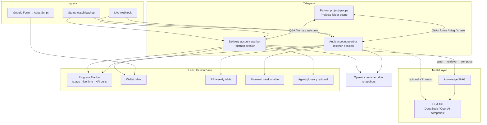

# Delivery Agent

Telegram **Userbot** + Lark (Feishu) automation for project delivery, KPI audit, and internal ops.

The same codebase runs **two** Telegram accounts:

| Account | Typical work |
|---------|----------------|
| **交付号** | Partner-group FAQ, welcome, live → Google Form → logo → wallet, tech-support tickets |
| **审核号** | KPI checks and writes, live-onboard Lark pings, weekly PR / frontend pings |

> These are **Userbots** (Telethon personal accounts), **not** BotFather bots.  
> Secrets stay local: `.env`, `*.session`, and real `config/*.yaml` are **never** committed.

> **Changelog:** dated shipping notes live in [CHANGELOG.md](CHANGELOG.md). This README is the map of what the system does now; the changelog is the history.

---

## Features (full list)

### 1. Scope & access control

| Feature | What it does |
|---------|----------------|
| **Folder scope** | Only listens / auto-replies inside configured Telegram *Projects* folders (e.g. multiple folders with a shared name prefix). |
| **Pilot mode** | Optional: FAQ auto-reply limited to listed pilot groups while testing. |
| **Group replies toggle / monitor mode** | When group replies are off, project-group questions and explicit @mentions of the delivery account are queued in the operator console for human review; welcome and ops workflows stay on. |
| **Ignored groups** | Hard skip list (`config/ignored_groups.yaml`). |
| **Ignore blacklist** | Listed users never get auto-replies (`config/whitelist.yaml` → `ignore_users`), except workflow operators on mark-live / send-form. |
| **QA testers** | Configured accounts/groups can ask without `@mention`, skip reply delay, and use ops commands (`config/qa_testers.yaml`). |
| **Workflow operators** | Username allowlist for mark-live / send-form / reports. |
| **Rate limit** | Per (chat, user) cooldown between auto-replies. |

---

### 2. FAQ / RAG auto-reply

| Feature | What it does |
|---------|----------------|
| **Knowledge RAG** | Retrieves chunks from `knowledge/` (markdown FAQ packs, help docs, learned notes). |
| **LLM compose** | DeepSeek / OpenAI-compatible chat; answers in the asker’s language (`auto` ZH/EN). |
| **Trigger rules** | Optional strict group mode (`trigger.require_explicit_mention`) replies only to an explicit `@`; otherwise supports reply-to-bot, question-like text, or `trigger.hint_keywords`. |
| **Stay silent when unsure** | Below `min_relevance_score`, blocked commercial topics, or model `NEEDS_HUMAN` → no reply. |
| **Multi-bubble replies** | Splits long answers on `---`; optional delay before first reply + gap between bubbles. |
| **FAQ footer** | Optional disclaimer after a successful FAQ reply only. |
| **URL hygiene** | Can scrub blocked URLs so they never appear in answers. |
| **Periodic KB reload** | Reloads knowledge on the same interval as folder refresh. |

---

### 3. Social chitchat

| Feature | What it does |
|---------|----------------|
| **Greetings** | Short emoji replies to `gm` / `gn` / `早上好` / `晚安` / etc. (not FAQ). |
| **X / Twitter shares** | Casual thanks when partners share short posts (links + “发了” style captions). |
| **FAQ fallback** | If RAG silences a social-shaped message, still send the social reply. |

---

### 4. Group welcome

| Feature | What it does |
|---------|----------------|
| **Join greeting** | When the account is added to a group whose title matches keywords. |
| **Language detection** | Samples recent non-bot messages → title hint → English fallback. |
| **Timed sequence** | Configurable ZH/EN multi-step welcome (`delay_seconds`). |
| **Min-message gate** | `0` = greet immediately; `>0` = wait for N non-bot messages. |
| **Baseline (no spam)** | Existing matching groups are marked “already greeted” on first enable — scans never backfill-greet old chats. |
| **Pilot kickoff** | Can greet configured pilot groups at startup. |
| **Backup scan** | Periodic scan only processes pending joins; does not spam baselined groups. |

---

### 5. Folder auto-add

| Feature | What it does |
|---------|----------------|
| **Auto-file new chats** | On join (and periodic scan), puts matching-title groups into the first free Projects folder. |
| **Keyword match** | Uses `scope.auto_add_keywords` (or welcome keywords). |
| **Capacity** | Respects ~100 chats per Telegram folder; optional auto-create `prefix #N` folders. |
| **Title cache** | Remembers chat titles for later form / KPI matching. |
| **TG rate limiting** | Serializes / paces heavy Telegram calls as folders grow. |

---

### 6. Live delivery workflow (Lark ↔ Telegram)

End-to-end path when a project goes **Mainnet Live**:

1. Detect live (webhook / status watch / TG mark-live)
2. Match Lark project ↔ Telegram group
3. Send Google onboarding form
4. Fill project logo into Lark (best-effort, once)
5. Partner submits form → Apps Script → Lark wallet table
6. Chase incomplete forms; optional wallet notify; daily Lark digest
7. On the audit account: live-onboard ping to the internal Lark group (after confirming the delivery account is in the TG group); auto-fill website / product / independence KPI cells when eligible

| Feature | What it does |
|---------|----------------|
| **Lark live webhook** | HTTP endpoint (default `/workflow/live`) when Progress status flips to live. |
| **Live status watch** | Polls Progress Tracker; only **new** live rows trigger form + logo (webhook backup). |
| **Deploy status watch** | Tracks enter/leave mainnet-live / mainnet-deploying / testnet-deploying for daily report. |
| **Startup live catch-up** | Optional one-shot process of live rows missing form/logo. |
| **Form dispatch** | Fuzzy-match project name to folder group title (or Lark TG chat id field); send templated message + form URL. |
| **Manual send form** | Ops command in the current group as fallback. |
| **Mark live** | Ops keyword sets Lark status to live and can also run form + logo. |
| **Logo fill** | Fetches site logo from live/project URL into Lark attachment field (one attempt; no retry on hard fail). |
| **Form / logo poll** | Optional expensive poller (off by default; prefer webhook + watch + mark-live). |
| **Form chase** | After the form is sent: daily reminder listing **still-missing** required fields, until the missing list is empty or the reminder cap is hit. An empty missing list stops chase even if a legacy `min_filled` threshold would have said otherwise. |
| **Wallet notify (TG)** | When required wallet fields are complete, notify configured chats (optional; often off). |
| **Lark wallet digest** | Daily Lark IM digest of newly collected wallet projects (Asia/Shanghai hour). |
| **Live onboard ping** | Audit account posts a live-onboard note to the configured Lark chat; checks the delivery account is in the TG group before sending. |
| **Form-received ping** | Optional; **off by default**. Does not ping the group when the Google form comes in. |
| **Baseline existing live** | First run can mark already-live rows as handled to avoid spam. |

**Workflow command aliases** (configurable; defaults in `config/config.yaml.example`):

| Action | Keywords |
|--------|----------|
| Mark live | `项目已上线`, `/mark_live`, `mark live`, `上线完成` |
| Send form | `/send_form`, `发送上线表单`, `send form` |

---

### 7. KPI audit (audit account)

Standard product checks on the Progress Tracker. Eligible rows: already mainnet-live, live date on or after `2026-09-01`. Official cadence is **Day 1** (live) → **Day 4** first check → **Day 7** recheck of held items only.

Telegram replies in the project group use English labels (Twitter / News/PR / Website / …), not the word “KPI”.

| Feature | What it does |
|---------|----------------|
| **`project diag`** | Runs remaining checks, writes result cells, and if 1–6 all pass, auto-writes item 7 + coordination + judgment time. Already-passed cells are not re-audited. |
| **`twitter diag`** | Official X account: ≥ `5` original posts in `30` days. Can also fill the News/PR URL from a matching mainnet PR tweet if that cell is empty. |
| **`website diag`** | Official site shows the chain name as required. |
| **`onchain diag`** | Mainnet contract, ≥ `3` unique wallets, ≥ `5` successful core txs. |
| **Live hook (3 / 4 / 5)** | On live: website check plus product-available and independence copy when those cells are empty. Live hook does **not** call the X API. |
| **News/PR (`pr support`)** | Quote a PR post in the project group and send `pr support` to overwrite the News/PR URL cell (and mark news verification passed). |

Coordination outcomes: **Valid KPI** / **Held for rectification** (Day 4) / **KPI failed** (Day 7 only). Group copy for official pushes is drafted separately; this repo does not auto-post those verification messages from the delivery console.

---

### 8. Weekly Lark pings (audit account)

| Feature | What it does |
|---------|----------------|
| **PR weekly** | Daily `00:00` refreshes the PR-link table. Sunday `23:55` prepares the ping; Monday `00:00:00` sends only. |
| **Frontend weekly** | Same clock for the live-project / logo / site table ping. |
| **No double send** | Past the send instant by more than a short grace, or if a ping already went out in the last 18 hours, skip until **next** week. Already-sent Lark posts are not edited. |

Templates: `config/pr_weekly.example.yaml` and the frontend-weekly example in `config/`.

---

### 9. Tech support escalation

| Feature | What it does |
|---------|----------------|
| **Quote + `tech support`** | Delivery or audit account replies to a project question and sends `tech support` / `/tech` to open a Lark ticket. |
| **Lark @ assignees** | Posts to the configured tech-support chat and @ the configured assignees. |
| **Ticket reply → TG** | When someone replies to that Lark ticket, the bot quotes the original TG question with the answer. |
| **Auto-learn + Agent KB** | After TG delivery, Q&A is saved under `knowledge/learned/` and upserted to the Agent glossary Bitable. |
| **Ops handbook** | [docs/tech-support-handbook.md](docs/tech-support-handbook.md). |

---

### 10. Operator console & metrics

| Feature | What it does |
|---------|----------------|
| **Delivery console** | Web console over disk-backed snapshots: delivery funnel (bind → deploy → form → wallet), project list, automations, analytics, audit log, monitor-mode human-review queue. KPI audit is **not** on this console yet. |
| **Persistent counters** | FAQ, social, welcome, folder add, form/logo, mark-live, webhooks, wallet digest, messages processed, etc. |
| **Stats (detail)** | Full Chinese ops breakdown. |
| **Weekly / exec report** | Management-facing summary for the **past 7 days**; also writes `data/delivery_agent_report.txt`. |
| **Daily report** | Rolling **past 24 hours**: new mainnet live, deploy transitions, new folder groups, new wallets, logos, bot message mix. |
| **Message detail log** | Append-only JSONL under `data/message_logs/messages-YYYY-MM-DD.jsonl` (retain N days, default 90); monitor-mode questions are marked `human_review` for the console queue. |

**Report command aliases** (Telegram, on-demand — no scheduled TG push):

| Report | Commands |
|--------|----------|
| Stats | `/stats`, `交付统计` |
| Weekly | `/report`, `交付周报`, `交付报告` |
| Daily | `/daily`, `/daily_report`, `交付日报`, `今日交付日报`, and compact colon variants |

Scheduled **Lark** weekly pings are separate (section 8).

---

### 11. Learn / absorb knowledge

| Feature | What it does |
|---------|----------------|
| **In-chat learn** | Message contains trigger word (default `学习`) → write a knowledge note under `knowledge/learned/`. |
| **Reply-learn** | Reply to a partner message with the trigger to absorb that content. |
| **Scope rules** | QA groups / QA testers / project folders (configurable). In project groups, typically **QA testers only**. |
| **KB reload** | Reloads chunks after a successful learn. |
| **Agent KB upsert** | Optional sync of learned Q&A into a Lark Bitable glossary (create/update by id; no full-table wipe). |

---

### 12. Lark knowledge sync

| Feature | What it does |
|---------|----------------|
| **Wiki → markdown** | Optional sync of a Lark wiki doc into `knowledge/lark_*.md` (startup + interval). |
| **Credentials** | `LARK_APP_ID` / `LARK_APP_SECRET` (+ wiki token when used). |

---

### 13. External companion (documented, not Python)

| Feature | What it does |
|---------|----------------|
| **Google Form → Lark wallet** | Apps Script (`scripts/google_form_to_lark.gs`) writes form submissions into the wallet bitable on submit. |

---

## Architecture (high level)

Same git repo, two production Telethon **userbots** (`python -m bot.main`) — personal Telegram accounts, **not** BotFather bots. Each host has its own systemd unit, `.env`, Telethon session, and `config/*.yaml`. KPI **checks and result writes** run only on the audit host (`kpi_checks_on_this_host()`); the delivery host may still run live watch, PR capture, and partner-facing flows.



Main path for one partner project: **group ready → mainnet live → form + logo + wallet → chase → KPI (+7d / +21d) → PR weekly + backlink → tech support / learn**.

Group FAQ path (on the userbot that is answering): **message → scope/trigger gate → RAG → LLM → reply bubbles**, or stay silent / queue for human review when the model returns `NEEDS_HUMAN`.

### Who does what

| Concern | Audit account | Delivery account |
|---------|---------------|------------------|
| Telegram userbot presence in partner groups | yes | yes |
| Partner FAQ / welcome / folder filing | optional | primary |
| RAG + LLM compose for group Q&A | optional | primary |
| Live → Google Form → logo fill | may assist | primary |
| Form chase / wallet digest notify | often primary for digest | configurable |
| KPI cell checks & writes | **only** | gated off |
| KPI auto schedule (+7 / +21) | **only** | off |
| LLM assist inside KPI flows when configured | **only** | gated off |
| Official verification push copy | drafted outside this console | — |
| Weekly PR / frontend Lark pings | **only** | off |
| PR `pr support` capture / backlink | audit writes KPI 2; backlink ping | capture may stay on |
| Tech-support ticket bridge | either | either |
| Operator console snapshots | either host’s disk | either host’s disk |

### Shared inputs / outputs

| Store | Role |
|-------|------|
| Progress Tracker | Source of truth for status, live time, KPI 1–7, coordination |
| Wallet Bitable | Form field mirror; digest “new since last run” |
| PR / frontend weekly tables | Derived weekly rows; ping targets, not the Progress source |
| `knowledge/` (+ optional Lark wiki sync) | FAQ RAG corpus fed into the LLM path |
| LLM API | Answer composition; optional assist in selected KPI checks |
| `data/*` on each host | Counters, watch state, chase state, message JSONL — **not** in git |
| Optional shared dir (e.g. PR capture events) | Cross-host event files when configured — **not** in git |

### Control plane notes

- **Userbots**, not BotFather bots — each account is a Telethon personal session.
- Folder scope, ignore lists, QA testers, and operator allowlists bound who the bots listen to and who may run ops keywords.
- Monitor mode can queue group questions for the operator console instead of calling the LLM reply path.
- Live webhook is the preferred live trigger; status watch is the backup for missed automations.
- Secrets: `.env`, `*.session`, real `config/*.yaml`, and LLM API keys stay on the hosts only.

Detail for each capability is in **Features** below; deploy wiring is in [`deploy/README.md`](deploy/README.md).

---

## Quick start

```bash
git clone https://github.com/Toytheboss/delivery-agent.git
cd delivery-agent
python3 -m venv .venv
source .venv/bin/activate
pip install -r requirements.txt

cp .env.example .env
cp config/config.yaml.example config/config.yaml
cp config/whitelist.yaml.example config/whitelist.yaml
cp config/qa_testers.yaml.example config/qa_testers.yaml
cp config/ignored_groups.yaml.example config/ignored_groups.yaml
```

Fill `.env` and `config/config.yaml`, then:

```bash
python scripts/login.py
python -m bot.main
```

For the server-oriented two-step login flow, run
`python scripts/server_login_complete.py` without arguments to enter the
Telegram verification code and 2FA password interactively. The password input
is hidden and is not stored in shell history.

Production: see [`deploy/README.md`](deploy/README.md). Two accounts mean two
systemd units / data dirs (same repo, different session and config). Shared
runtime files (if used) stay **off** git.

---

## Layout

```
bot/           Handlers, RAG, welcome, folder auto-add, Lark workflows, KPI, weekly pings, metrics
config/        *.example templates only (real YAML is gitignored)
knowledge/     FAQ / docs packs (add private packs locally if needed)
scripts/       Login, Lark KB upsert, Google Form → Lark Apps Script, webhook docs
deploy/        systemd + bootstrap
docs/          Operator notes (whitelist, workflows, tech support)
static/        Operator console prototype
assets/        Optional brand assets for decks / docs
```

---

## Configuration map

Primary file: `config/config.yaml.example`. Extra fragments:

| File | Controls |
|------|----------|
| `config/pr_weekly.example.yaml` | PR weekly table refresh + Monday `00:00:00` ping |
| `config/*weekly.example.yaml` | Frontend weekly table refresh + Monday `00:00:00` ping |
| `config/tech_support.example.yaml` | Tech-support Lark chat and assignees |

| Block | Controls |
|-------|----------|
| `scope` | Folders, pilot, auto-add, refresh interval, group replies |
| `trigger` | Explicit-mention-only mode, mention/question gate, hint keywords |
| `reply` | Delays, bubbles, relevance threshold, language, FAQ footer |
| `rules` / `safety` | System rules, blocked commercial topics |
| `learn` | Trigger word, scopes, Agent KB table |
| `knowledge` | Directory, chunk size, `top_k` |
| `lark` | Wiki sync on/off + interval |
| `workflow` | Live webhook/watch, form, logo, chase, digest, live onboard, operators, command aliases |
| `llm` | Provider, model, temperature |
| `telegram` | Session name |
| `metrics` | Counters + message JSONL log retention |
| `welcome` | Keywords, sequences ZH/EN, min messages, scan |

Companion YAML: `whitelist.yaml`, `qa_testers.yaml`, `ignored_groups.yaml`.

---

## Environment variables

| Variable | Purpose |
|----------|---------|
| `TELEGRAM_API_ID` / `TELEGRAM_API_HASH` | Telethon login |
| `TELEGRAM_PROXY` | Optional `socks5://` / `http://` proxy |
| `LOG_LEVEL` | Logging verbosity |
| `DEEPSEEK_API_KEY` or `OPENAI_API_KEY` | LLM |
| `LARK_APP_ID` / `LARK_APP_SECRET` | Bitable / wiki / digest / pings |
| `LARK_WIKI_TOKEN` | Optional wiki sync |
| `WORKFLOW_LIVE_WEBHOOK_SECRET` | Optional override for live webhook auth |

---

## Ops cheat sheet

| You want… | Do this |
|-----------|---------|
| FAQ in a partner group | Ensure the group is in a scoped folder; ask with `@` or a clear question |
| Greet a new partner group | Title matches welcome keywords; add the delivery account to the group |
| Mark project live + send form | Operator sends `项目已上线` (or alias) in the group |
| Resend form manually | `/send_form` / `发送上线表单` |
| Escalate a tech question | Quote the question, then `tech support` |
| Write a News/PR URL | Quote the PR post, then `pr support` |
| Run KPI checks | In the project group on the **audit** account: `project diag` / `twitter diag` / `website diag` / `onchain diag` |
| See last 24h ops | `交付日报` / `/daily` |
| See last 7 days summary | `交付周报` / `/report` |
| Full counters | `交付统计` / `/stats` |
| Teach the bot a fact | QA tester: `学习 …` (or configured trigger) |
| Watch delivery funnel | Operator console (snapshots; not a substitute for the Progress Tracker KPI cells) |
| Audit ask/reply text | Read `data/message_logs/messages-YYYY-MM-DD.jsonl` on the server |

More operator detail: [`docs/delivery-operator-whitelist.md`](docs/delivery-operator-whitelist.md).

---

## Security

- Do **not** commit `.env`, Telegram sessions, or real `config/*.yaml`
- Keep private product/brand knowledge out of public forks if needed
- Follow Telegram ToS for userbots
- Prefer webhook + status watch over folder-wide form polling on large estates (avoids Telegram flood waits)
- Runtime state, shared onboard files, and group caches stay off git

---

## License

Private / internal use.
