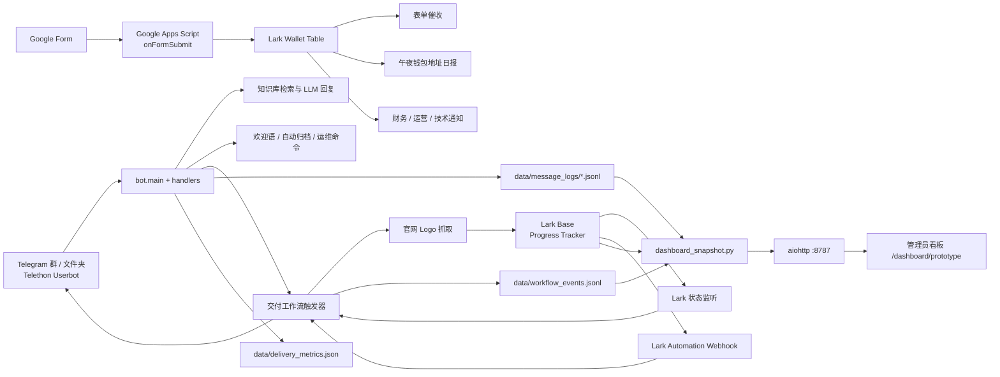

# Delivery Agent 交付系统技术文档

版本：1.0  
更新时间：2026-08-18  
适用代码版本：`ec85074` 及之后  
系统性质：内部项目交付自动化平台

> 本文是交接、维护、排障和后续开发的主文档。文档只写字段名、接口和示例，不写真实密钥、Telegram session、生产群 ID 或私有业务数据。

## 目录

1. [系统定位与边界](#1-系统定位与边界)
2. [总体架构](#2-总体架构)
3. [代码模块地图](#3-代码模块地图)
4. [数据归属与数据源](#4-数据归属与数据源)
5. [Lark Base 数据字典](#5-lark-base-数据字典)
6. [本地状态文件与日志字典](#6-本地状态文件与日志字典)
7. [指标与看板数据口径](#7-指标与看板数据口径)
8. [HTTP 接口文档](#8-http-接口文档)
9. [Lark、Telegram、Google 接口](#9-larktelegramgoogle-接口)
10. [完整业务流程](#10-完整业务流程)
11. [匹配、幂等和状态机](#11-匹配幂等和状态机)
12. [定时任务和运行时行为](#12-定时任务和运行时行为)
13. [管理员看板与设置](#13-管理员看板与设置)
14. [部署、启动和运维](#14-部署启动和运维)
15. [安全、备份和数据保留](#15-安全备份和数据保留)
16. [测试与验收](#16-测试与验收)
17. [故障排查手册](#17-故障排查手册)
18. [当前限制与后续建议](#18-当前限制与后续建议)

---

## 1. 系统定位与边界

### 1.1 系统做什么

Delivery Agent 是一个以 Telegram Userbot 为入口、以 Lark Base 为项目主数据、以本地 JSON/JSONL 为运行状态和审计日志的跨平台交付系统。它负责：

- 自动发现和归档项目 Telegram 群；
- 新群自动问候；
- 在项目群中根据知识库回答技术和生态接入问题；
- 监听 Lark 项目状态，触发主网上线后的表单、Logo、钱包流程；
- 将 Google 表单回收内容同步到 Lark 钱包表；
- 生成钱包地址日报、项目状态日报和运营统计；
- 给管理员提供实时看板、项目详情、事件时间线和运行时设置。

### 1.2 不负责什么

- 不替代 Lark Base 的项目数据录入和审批流程；
- 不替代 Google Form 的表单定义和 Google Apps Script 触发器；
- 不把 Telegram 群标题当作绝对主键，模糊匹配有歧义时必须人工确认；
- 不保证 LLM 在知识库没有依据时回答，低相关度和敏感话题应保持沉默；
- 不把前端静态页面中的演示默认值视为生产数据，生产页面应由 `/dashboard/api/snapshot` 覆盖。

### 1.3 关键名词

| 名词 | 含义 |
|---|---|
| Progress Tracker | Lark 中保存项目、BD、交付人员和项目状态的主表 |
| Wallet Table | Lark 中保存项目方表单资料、Logo 和钱包地址的表 |
| Agent KB | Lark 中可选的学习词条表；本地 `knowledge/` 才是运行时检索入口 |
| Delivery folder | Telegram 左侧项目文件夹，默认 `Projects #1`、`Projects #2` 等 |
| live | 项目已主网上线；由 `workflow.trigger_status` 的精确值或状态前缀识别 |
| first_seen | 钱包表记录第一次被系统观察到的日期，不等同于 Lark 的记录创建时间 |
| baseline | 首次启动时将现有存量标记为已处理，防止历史项目被重复发送消息 |

---

## 2. 总体架构



### 2.1 运行进程

生产环境当前原则上只运行一个 systemd 服务：

```text
delivery-agent.service
  └─ python -m bot.main
       ├─ Telethon Telegram 长连接
       ├─ aiohttp Webhook / Dashboard :8787
       ├─ Lark Wiki 同步循环
       ├─ Folder / Welcome / Workflow 定时循环
       └─ Dashboard 快照刷新循环
```

Webhook 和看板由同一个 aiohttp 进程承载，避免额外的 Web 服务进程。旧版看板入口已经重定向到新版 `/dashboard/prototype`，不应重新启动另一套前端服务。

### 2.2 数据流原则

1. Lark Base 是项目状态和钱包资料的业务主数据。
2. Telegram 是群、消息、群标题和消息发送结果的事实来源。
3. Google Form 是项目方输入入口，Google Apps Script 是表单到 Wallet Table 的同步层。
4. 本地 JSON 是幂等、去重、轮询基线和缓存，不应被当作人工主数据编辑。
5. JSONL 是追加式审计流；看板可以读取它，但业务动作不能只依赖看板快照。
6. 前端浏览器永远不接触 Lark credentials，只接收服务器裁剪后的数据。

---

## 3. 代码模块地图

| 路径 | 职责 | 关键入口 |
|---|---|---|
| `bot/main.py` | 启动、初始化、创建后台循环 | `main()` |
| `bot/config_loader.py` | YAML、环境变量、runtime overrides 合并 | `load_config()` |
| `bot/handlers.py` | Telegram 入站消息总分发 | `MessageHandler.handle()` |
| `bot/triggers.py` | 问题、闲聊、白名单、QA、操作员判定 | `should_process()` 等 |
| `bot/rag.py` | 检索、LLM 调用、长回复拆泡 | `generate_reply()` |
| `bot/knowledge.py` | Markdown 知识库加载、切块、检索 | `KnowledgeBase` |
| `bot/group_welcome.py` | 新群欢迎序列、语言识别、基线 | `register_welcome_handlers()` |
| `bot/folder_auto_add.py` | 新群放入 Telegram Projects 文件夹 | `scan_and_add_missing()` |
| `bot/folder_scope.py` | Folder → chat_id 集合缓存 | `FolderScope.refresh()` |
| `bot/lark_bitable.py` | Lark Base HTTP 封装 | `list_records/update_record/create_record` |
| `bot/lark_im.py` | Lark IM 发消息、建群、邮箱转 open_id | `send_text_to_chat()` |
| `bot/workflow_live_watch.py` | Lark 主网上线状态差分监听 | `live_status_watch_loop()` |
| `bot/workflow_lark_webhook.py` | Lark 自动化 HTTP 回调 | `POST /workflow/live` |
| `bot/workflow_live_trigger.py` | 单项目上线后编排表单 + Logo | `process_live_project()` |
| `bot/workflow_form_dispatch.py` | TG 群匹配、发送表单、发送去重 | `run_form_dispatch_once()` |
| `bot/workflow_mark_live.py` | TG 操作口令写回 Lark 状态 | `mark_live_from_group()` |
| `bot/workflow_form_chase.py` | 24 小时后按缺失字段催收 | `form_chase_loop()` |
| `bot/workflow_logo_fill.py` | 官网 Logo 抓取并写回 Lark | `fill_logo_for_fields()` |
| `bot/workflow_lark_wallet_group.py` | 钱包表 first_seen 与午夜日报 | `lark_digest_loop()` |
| `bot/workflow_wallet_notify.py` | 钱包资料齐全后通知内部群 | `wallet_notify_loop()` |
| `bot/workflow_events.py` | 统一追加自动化事件日志 | `append_event()` |
| `bot/message_log.py` | Telegram 每条消息明细日志 | `log_message_event()` |
| `bot/metrics.py` | 日粒度指标、日报和窗口统计 | `snapshot()/build_period_reports()` |
| `bot/dashboard_snapshot.py` | 看板快照、项目行、流程、异常 | `build_dashboard_snapshot()` |
| `bot/dashboard_http.py` | 管理员会话、HTTP 路由 | `register_dashboard_routes()` |
| `bot/dashboard_settings.py` | 允许运行时调整的配置白名单 | `SETTING_SPECS` |
| `scripts/google_form_to_lark.gs` | Google 表单提交同步 Wallet Table | `onFormSubmit(e)` |

---

## 4. 数据归属与数据源

| 数据对象 | 系统 | 是否主数据 | 读取方 | 写入方 |
|---|---|---:|---|---|
| 项目名称、状态、BD、交付 | Lark Progress Tracker | 是 | 状态监听、看板、表单触发器 | 交付人员、TG 操作口令、Lark 自动化 |
| 项目链接、上线链接、Logo | Lark Progress Tracker | 是 | Logo 流程、看板 | Logo 回填流程、交付人员 |
| 项目方钱包和资料 | Lark Wallet Table | 是 | 催收、日报、看板、部门通知 | Google Apps Script、人工补录 |
| Telegram chat_id / 群标题 | Telegram | 是 | Folder scope、匹配、看板 | Telegram、标题缓存 |
| FAQ 知识 | 本地 Markdown / 可选 Lark Wiki | 运行时主数据 | RAG | 人工文件、Lark Wiki 同步、学习功能 |
| 处理状态、去重集合 | `data/*.json` | 否，运行状态 | 对应 workflow | 对应 workflow |
| 自动化时间线 | `data/workflow_events.jsonl` | 审计证据 | 看板、排障 | 各 workflow |
| 消息问答明细 | `data/message_logs/messages-YYYY-MM-DD.jsonl` | 审计证据 | 看板、沉默分析 | Telegram handler |
| 看板快照 | `data/dashboard_snapshot.json` | 缓存 | Dashboard API | 快照刷新循环 |

### 4.1 判断真实数据的规则

- 看板上的项目列表：每次 API 请求会重新读取 Lark Progress Tracker，并合并本地状态。
- 看板上的钱包覆盖率：读取 Lark Wallet Table，不使用前端固定数字。
- 看板上的 Bot 回答和沉默：读取 `message_logs`，不是 LLM 内存计数。
- 看板上的最近活动：优先使用 `workflow_events.jsonl`、Logo 事件和消息日志；没有时间戳的历史状态只能显示“历史状态无时间”。
- 看板快照最多缓存 `dashboard.refresh_minutes` 分钟；强制刷新可使用 `/dashboard/api/snapshot?refresh=1`。

---

## 5. Lark Base 数据字典

### 5.1 Progress Tracker（项目进度主表）

表 ID 由 `workflow.progress_table_id` 配置，App Token 由 `workflow.base_app_token` 配置。真实环境不要把 token 写入本文档。

| 字段名 | 建议类型 | 必填 | 语义 | 读取/写入 |
|---|---|---:|---|---|
| `record_id` | Lark 系统字段 | 是 | 行的稳定主键 | 所有流程读取 |
| `项目名称 Project Name` | 文本 | 是 | 项目显示名称，也是 TG 模糊匹配主输入 | 所有流程读取 |
| `项目状态` | 单选/文本 | 是 | 项目当前阶段 | 状态监听读取；TG mark-live 写入 |
| `BD` | 文本/人员 | 否 | 对应 BD；看板项目表展示和筛选 | 看板读取 |
| `交付` | 文本/人员 | 否 | 对应交付人员 | 看板读取 |
| `更新日期` | 日期 | 否 | Lark 行最近更新时间；可作为上线统计后备时间 | 指标、项目时间线读取 |
| `录入时间` | 日期 | 否但推荐 | Lark Track 新增项目统计口径 | 数据分析读取 |
| `主网上线时间` | 日期 | 否 | 计划或实际主网时间，不能单独证明已上线 | 指标读取 |
| `项目链接` | URL | 否 | 项目官网或主项目链接 | Logo 抓取后备输入 |
| `已上线链接🔗` | URL | 否 | 主网上线后链接 | Logo 抓取首选输入 |
| `项目logo` | 附件/图片 | 否 | 项目 Logo | Logo 流程写入、看板读取是否存在 |
| `TG群ID`（可选） | 文本/数字 | 否 | 精确绑定 Telegram chat_id；配置到 `tg_chat_id_field` 后优先于模糊匹配 | 表单发送、看板读取 |
| `表单发送状态`（可选） | 文本/单选 | 否 | 例如 `已发送`；配置到 `form_sent_field` 后用于二次幂等 | 表单发送读取/写入 |

#### 状态语义

代码对状态使用两套判断：

1. 主网上线触发：`workflow.trigger_status` 做精确比较，例如 `Mainnet Live`。
2. 看板和日报分类：对状态前缀做归类：
   - `BOT主网上线` 或 `主网上线` → `live`
   - `主网部署中` → `main_deploy`
   - `测试网部署` → `test_deploy`

因此如果 Lark 改了状态文案，必须同时检查 `config.yaml` 和 `bot/metrics.py` / `bot/workflow_deploy_status_watch.py` 的识别规则。

### 5.2 Wallet Table（项目方钱包地址搜集）

目标表 ID 由 `workflow.wallet_table_id` 配置。Google Apps Script 通过表单问题标题映射到这些字段。

| 字段名 | 来源 | 是否纳入地址计数 | 说明 |
|---|---|---:|---|
| `Project name` | Google Form | 否 | 去重和项目关联主键，必填 |
| `Project logo` | Google Form / 人工 | 否 | 项目方自填或补充 |
| `Contract Addresss/主网合约` | Google Form | 是 | 字段名中的 `Addresss` 拼写必须保持兼容 |
| `Treasury Address` | Google Form | 是 | Treasury 钱包 |
| `Fee Collector / Revenue Wallet Address` | Google Form | 是 | 手续费/收入钱包 |
| `Grant Receiving Wallet (Optional)` | Google Form | 是 | 可选 Grant 钱包 |
| `MM / LP Wallet （Optional）` | Google Form | 是 | 做市/流动性钱包；括号为全角 |
| `Bridge Pool / Relayer Wallet (Optional)` | Google Form | 是 | 跨链池/中继钱包 |
| 其他自定义字段 | Google Form | 否 | 未加入 `ADDRESS_FIELDS` 的字段不会进入地址数量 |

地址“已填”的判断是：文本、链接、附件等字段经过 `_field_text()` 后非空。`wallet_digest_new_projects` 统计的是新出现且至少有项目名和至少一个地址字段的行。

### 5.3 Agent KB 表

由 `learn.agent_kb.app_token` 和 `learn.agent_kb.table_id` 指定，可选。运行时字段：

| 字段名 | 说明 |
|---|---|
| `文本` | 主标题，格式通常为 `LEARN-时间 | 问题` |
| `编号` | 稳定去重键，如 `LEARN-20260818_120000` |
| `分类` | 默认 `Learned / 自动学习` |
| `问题` | 相关问题 |
| `答案` | 参考回答，最长约 3500 字符 |
| `关键词` | 检索关键词 |
| `来源` | 本地文件、chat_id、sender 等来源信息 |
| `更新时间` | ISO 时间字符串 |

Agent KB 同步是 upsert，不会清空整张表。同步失败不应阻断 Telegram 回复。

---

## 6. 本地状态文件与日志字典

所有相对路径都相对于项目根目录。生产数据目录不应提交 Git。

### 6.1 状态文件

| 文件 | 核心结构 | 用途 | 能否手工删除 |
|---|---|---|---:|
| `data/form_dispatch_state.json` | `{sent_record_ids: []}` | Google Form 已发送的 Progress record_id 集合 | 谨慎；删除会导致重复发送 |
| `data/live_status_watch_state.json` | `{seen_live_record_ids: []}` | 主网上线监听基线 | 谨慎；删除会重新 baseline |
| `data/deploy_status_watch_state.json` | `{statuses:{rid:status},events:[],baselined_at}` | 主网/测试网状态差分及事件 | 可以备份后重建 |
| `data/logo_fill_state.json` | `{processed_record_ids:[],results:{rid:status}}` | Logo 每行只处理一次 | 删除会重复抓取 |
| `data/form_chase_state.json` | `{projects:{rid:{project_name,chat_id,first_sent_at,reminders_sent,done,...}}}` | 表单催收计时和完成状态 | 不建议删除 |
| `data/lark_wallet_digest_state.json` | `{first_seen:{rid:date},digested_ids:[],last_digest_date}` | 钱包行首次观察和日报去重 | 不建议删除 |
| `data/wallet_notify_state.json` | `[]` 或 `{notified_record_ids:[]}` | 内部部门通知去重 | 不建议删除 |
| `data/group_welcome_state.json` | `greeted_chat_ids,pending_chat_ids,pending_msg_counts,baseline_scope` | 新群欢迎序列幂等 | 删除可能重复欢迎 |
| `data/folder_title_cache.json` | `{titles:{chat_id:{title,ts}}}` | TG 标题缓存，TTL 约 6 小时 | 可删，系统会重新拉取 |
| `data/delivery_metrics.json` | `{version,updated_at,counters,notes}` | 日粒度累计指标 | 删除会丢历史指标 |
| `data/dashboard_snapshot.json` | 看板聚合 JSON | 快照缓存，不是主数据 | 可删，系统会重建 |
| `data/runtime_overrides.yaml` | 允许运行时修改的配置子集 | 看板设置持久化 | 修改前备份 |

### 6.2 workflow_events.jsonl

每行是一个 JSON 对象，典型字段：

```json
{
  "ts": "2026-08-18T00:12:34+08:00",
  "day": "2026-08-18",
  "kind": "form_sent",
  "source": "lark_webhook",
  "project_name": "Example",
  "text": "Example Google 表单已发送",
  "status": "success",
  "record_id": "recxxxxxxxx",
  "chat_id": -1001234567890
}
```

常见 `kind`：

| kind | 产生位置 | 含义 |
|---|---|---|
| `folder_chat_added` | Folder 自动归档 | 群被加入项目文件夹 |
| `welcome_sequence_sent` | 欢迎模块 | 欢迎序列完成 |
| `form_sent` | 上线触发器 | Google Form 发出 |
| `form_dispatch_skipped` | 表单匹配 | 没有群或多个候选，跳过 |
| `form_dispatch_failed` | 表单发送 | Telegram 发送失败 |
| `form_chase_reminder` | 催收模块 | 24 小时后催收 |
| `logo_uploaded_lark` | Logo 模块 | Logo 成功写回 Lark |
| `wallet_collected` | 钱包同步 | Wallet 行首次出现且有地址 |
| `wallet_digest_sent` | 钱包日报 | 日报消息已发送 |
| `wallet_notified` | 部门通知 | 钱包资料已推送内部群 |
| `lark_status_changed` | 状态监听 | 项目状态发生关注的变化 |
| `live_webhook_processed` | Webhook | Lark 上线回调完成 |

### 6.3 message_logs JSONL

文件：`data/message_logs/messages-YYYY-MM-DD.jsonl`。每条入站消息最多记录一行；Bot 发送的每条气泡也会进入出站明细（由 handler 发送路径记录）。典型字段：

```json
{
  "ts": "2026-08-18T10:00:00+08:00",
  "kind": "faq|social|welcome|outbound|silent",
  "chat_id": -1001234567890,
  "chat_title": "Example <> Delivery",
  "sender_id": 123456,
  "sender_username": "partner",
  "message_id": 987,
  "text": "How do I integrate ...?",
  "reply_text": "...",
  "qa": false,
  "qa_group": false,
  "outcome": "replied|silent|skipped|sent",
  "reason": "low_relevance|blocked_topic|needs_human|rate_limited|outbound",
  "score": 0.82,
  "bubbles": 2,
  "extra": {}
}
```

`reply_text` 可能被截断；它用于运营审计，不是完整消息存档。消息日志默认保留 60 天，由 `message_log` 在每天第一次写入时执行旧文件清理。

### 6.4 logo_fill_events.jsonl

```json
{
  "ts": "2026-08-18T12:00:00+08:00",
  "day": "2026-08-18",
  "record_id": "recxxxxxxxx",
  "project_name": "Example",
  "status": "ok:http|ok:playwright|already_has_logo|no_url|err:..."
}
```

Logo 以 record_id 为幂等键。一次失败会写入 `processed_record_ids`，当前设计不会自动重试；需要人工删除该 record_id 状态或执行专用补录脚本后再重跑。

---

## 7. 指标与看板数据口径

### 7.1 时间窗口

看板统一提供：

- `24h`：当前时间往前 24 小时；
- `7d`：当前时间往前 168 小时；
- `30d`：当前时间往前 720 小时。

时间均使用 `Asia/Shanghai`。日粒度计数以本地日期桶近似滚动窗口，因此跨午夜时应以页面脚注和 `window_since` 为准。

### 7.2 顶部统计卡片

| 卡片 | 数据来源 | 口径 |
|---|---|---|
| 主网部署 | Lark Progress + 状态差分 | 当前为 live 且上线时间/更新日期在窗口，或监听到窗口内进入 live |
| 测试网部署 | Lark Progress | 当前状态为 `测试网部署` 的存量数量；不是严格的窗口新增量 |
| Lark Track 新增项目 | Lark Progress | 项目名非空且 `录入时间` 在窗口内 |
| 新增 TG 群 | `folder_auto_add_success` | 系统在窗口内成功放入 Delivery folder 的群数 |
| Bot 已回答 | `message_logs` / `messages_sent` | 按窗口统计实际出站消息和问答 |
| 沉默 / 转人工 | `message_logs` | 低相关、需要人工、敏感话题等静默事件 |

如果 `录入时间` 为空，Lark Track 新增项目不会被计数；不得用 `更新日期` 静默替代，否则修改旧项目也会被误判为新增。

### 7.3 项目交付页面

项目行由 Lark Progress 记录和本地证据拼接，输出字段包括：

```text
record_id, project, stage, stage_label, status_raw,
bd, delivery, updated_at,
chat_id, chat_title, tg_bound, tg_ambiguous,
tg_match_candidates, tg_match_reason, tg_ignored,
lark_bound, form_sent, form_completed,
wallet_record_id, wallet_fields_present,
wallet_digest_completed, logo_status,
delivery_steps[], project_events[], issues[]
```

每个项目最多展示最近 30 条项目事件。没有事件日志但有持久状态的老项目，会显示“历史状态无时间”，不能伪造时间戳。

### 7.4 自动化任务页面

当前任务按业务流程顺序展示：

1. 项目群自动归档
2. 新群自动问候
3. 交付 Bot 问答
4. Lark 知识库同步
5. 主网上线 Webhook
6. Lark 状态监听
7. Google 表单发送
8. 表单自动催收
9. Logo 自动回填
10. 钱包地址日报
11. 消息指标与真实日志
12. 看板快照刷新

任务“今日执行”来自持久指标或事件日志，不是前端静态演示数值。

---

## 8. HTTP 接口文档

默认监听：`0.0.0.0:8787`。公网访问应放在 Cloudflare Tunnel、反向代理或 HTTPS 后面。

### 8.1 健康检查

```http
GET /health
```

响应：

```json
{
  "ok": true,
  "service": "delivery-live-webhook",
  "dashboard": true,
  "webhook": true
}
```

注意：健康检查只表示 aiohttp 进程在监听，不代表 Telegram、Lark 或所有后台循环都正常。深度健康检查应结合 systemd 日志和看板数据更新时间。

### 8.2 Lark 主网上线 Webhook

```http
POST /workflow/live
X-Webhook-Secret: <WORKFLOW_LIVE_WEBHOOK_SECRET>
Content-Type: application/json
```

请求可以传 record_id 或项目名，支持嵌套在 `record`、`data`、`object`、`event` 中：

```json
{
  "record_id": "recxxxxxxxx",
  "project_name": "Example",
  "status": "Mainnet Live"
}
```

也可使用查询参数：

```text
/workflow/live?secret=<secret>&record_id=recxxxxxxxx
```

鉴权接受：`X-Webhook-Secret`、`Authorization: Bearer <secret>` 或 `secret` 查询参数。Webhook 会再次读取 Lark 行并校验状态，不能只相信请求体的 status。

响应：

```json
{
  "ok": true,
  "source": "lark_webhook",
  "record_id": "recxxxxxxxx",
  "project_name": "Example",
  "form": "sent|already_sent|no_group:<reason>|send_failed:<error>",
  "logo": "ok:http|ok:playwright|already_has_logo|no_url|err:<error>",
  "error": null
}
```

状态码：

| 状态码 | 含义 |
|---:|---|
| 200 | 处理成功或已幂等完成 |
| 400 | 缺少 record_id 和 project_name |
| 401 | secret 不正确 |
| 422 | 找不到行、状态不为 live 或流程执行失败 |

Lark URL verification 请求 `type=url_verification` 会直接回传 `challenge`。

### 8.3 管理员登录

```http
POST /dashboard/api/login
Content-Type: application/json
```

```json
{"username":"Roy","password":"<password>"}
```

成功后设置 HttpOnly cookie：`delivery_admin_session`，有效期 8 小时。用户名不区分大小写，但响应使用配置中的规范大小写。15 分钟内同一 IP+用户名失败 5 次会返回 429。

### 8.4 看板 API

以下接口都需要管理员 cookie：

| 方法 | 路径 | 作用 |
|---|---|---|
| `POST` | `/dashboard/api/logout` | 清除管理员会话 |
| `GET` | `/dashboard/api/snapshot` | 读取看板快照和实时项目流程 |
| `GET` | `/dashboard/api/snapshot?refresh=1` | 强制重建快照 |
| `GET` | `/dashboard/api/day?date=YYYY-MM-DD` | 读取单日明细，受日志保留窗口限制 |
| `GET` | `/dashboard/api/settings` | 读取设置面板字段和当前值 |
| `PUT` | `/dashboard/api/settings` | 更新 allowlist 内的运行时配置 |
| `GET` | `/dashboard/api/learned` | 查看本地 learned Markdown |
| `POST` | `/dashboard/api/learned` | 新增学习条目，可选同步 Agent KB |
| `DELETE` | `/dashboard/api/learned/{name}` | 删除安全文件名匹配的学习条目 |
| `POST` | `/dashboard/api/knowledge/reload` | 重新加载本地知识库 |

浏览器拿到的 snapshot 顶层通常包含：

```text
generated_at, timezone, window, metrics_updated_at,
snapshot, daily, period_reports, counters_series,
qa, calendar, ranges, automation,
projects, workflow
```

### 8.5 设置更新示例

```http
PUT /dashboard/api/settings
Cookie: delivery_admin_session=...
Content-Type: application/json
```

```json
{
  "values": {
    "reply.min_relevance_score": 0.58,
    "workflow.form_chase_enabled": true,
    "metrics.message_log_retain_days": 30
  }
}
```

服务端只接受 `dashboard_settings.SETTING_SPECS` 中的键，未知键会被忽略。更新后会写入 `data/runtime_overrides.yaml`，并立即修改当前进程的 `AppConfig`。需要重启才能让所有依赖启动时读取的行为完全一致。

---

## 9. Lark、Telegram、Google 接口

### 9.1 Lark Base API 封装

`bot/lark_bitable.py` 统一使用：

```text
https://open.larksuite.com/open-apis
```

| 封装函数 | HTTP API | 用途 |
|---|---|---|
| `get_tenant_access_token` | `POST /auth/v3/tenant_access_token/internal` | app_id + app_secret 换 token |
| `list_records` | `GET /bitable/v1/apps/{app_token}/tables/{table_id}/records` | 分页读取，默认最多每页 500 |
| `update_record` | `PUT /bitable/v1/apps/{app_token}/tables/{table_id}/records/{record_id}` | 更新字段 |
| `create_record` | `POST .../records` | 新增记录 |
| `list_fields` | `GET .../fields` | 读取单选项和字段定义 |
| `create_field` | `POST .../fields` | Agent KB 缺字段时创建 |
| `batch_create_records` | `POST .../records/batch_create` | 批量导入 |
| `batch_delete_records` | `POST .../records/batch_delete` | 批量删除，使用前必须备份 |

所有响应必须检查 `code == 0`。网络错误、权限错误、字段类型错误会抛出 `LarkBitableError` 或上层异常；workflow 应捕获并记录，不应让 Telegram 主循环退出。

### 9.2 Lark IM API

| 函数 | API | 用途 |
|---|---|---|
| `resolve_open_ids_by_emails` | `POST /contact/v3/users/batch_get_id` | 邮箱转 open_id |
| `create_group_chat` | `POST /im/v1/chats` | 创建内部群 |
| `send_text_to_chat` | `POST /im/v1/messages?receive_id_type=chat_id` | 发钱包日报或部门通知 |

### 9.3 Telegram API 使用方式

系统使用 Telethon Userbot，而不是 BotFather Bot：

- 登录状态保存在 `delivery_session.session` 或配置的 session 名称；
- 监听 `events.NewMessage` 和 `events.ChatAction`；
- Folder 通过 `GetDialogFiltersRequest` 读取和更新；
- 发送消息使用 `client.send_message(chat_id, text)`；
- 获取群标题会使用缓存和节流，避免 Telegram FloodWait；
- 任何大规模 `get_entity` 或 folder 扫描都应走 `tg_rate_limit.py`。

### 9.4 Google Form → Lark

脚本文件：`scripts/google_form_to_lark.gs`。

触发器：Google Spreadsheet 的“表单提交时”调用 `onFormSubmit(e)`。脚本会：

1. 读取 `e.namedValues`；
2. 用 `FIELD_MAP` 将问题标题映射为 Lark 字段；
3. 必须有 `Project name`；
4. 按项目名（忽略大小写、首尾空格）查 Wallet Table；
5. 已存在则 `update_record`，不存在则 `create_record`；
6. 未映射的问题写入 Apps Script 日志，不会自动丢失提醒。

表单改题目后，必须同步修改 `FIELD_MAP` 并重新测试一条提交记录。

---

## 10. 完整业务流程

### 10.1 新群进入交付系统

```text
BD/交付人员把交付账号加入 TG 群
  ↓ ChatAction
检查群标题是否命中 welcome.name_keywords
  ↓
加入第一个有容量的 Projects folder
  ↓
写入 folder_title_cache.json 和 folder_chat_added 事件
  ↓
采样最近非 Bot 消息，判断中文/英文
  ↓
发送欢迎序列（0/30/60 秒等）
  ↓
写入 group_welcome_state.json 和 welcome_sequence_sent 事件
```

如果 `ignored_group_ids` 命中，消息自动回复和欢迎会被跳过。首次启动或 pilot 范围变化会 baseline 已有群，不会把历史群重新问候。

### 10.2 TG 自动答疑

```text
Telegram NewMessage
  ↓
忽略黑名单、忽略群、Bot 自己发出的消息
  ↓
判断范围（Projects folder / pilot / QA 私聊 / QA 群）
  ↓
运维命令？→ stats / report / daily
上线口令？→ mark-live
发送表单口令？→ send-form
学习口令？→ 写 learned Markdown
  ↓
闲聊/问候/短确认？→ 发送简短社交回复
  ↓
@Bot、回复 Bot、问题形态或提示关键词？
  ↓
知识检索 → 相关度阈值 → LLM 生成
  ↓
NEEDS_HUMAN / blocked / low score → 静默并记录原因
否则 → 按 --- 拆成多个气泡逐条发送并记录每条出站消息
```

静默不是异常：系统的安全原则是“宁可不答，也不编造”。管理看板中的沉默原因用于人工优化知识库和触发规则。

### 10.3 项目主网上线

支持三种触发入口：

1. Lark Automation 调用 `POST /workflow/live`；
2. `live_status_watch` 每 60 秒轮询 Progress Tracker 做差分；
3. 交付人员在 TG 群发送 `项目已上线`、`/mark_live` 等操作口令。

统一进入 `process_live_project()`：

```text
确认 workflow.enabled
  ↓
按 record_id 或唯一项目名读取 Lark 行
  ↓
确认项目状态等于 workflow.trigger_status
  ↓
表单发送：TG群ID 精确字段 > preferred chat > 模糊匹配
  ↓
发送成功后写 form_dispatch_state，并可回写“表单发送状态”
  ↓
记录 form_sent 事件，并登记 form_chase
  ↓
Logo：已有 Logo → 跳过；否则 HTTP 抓取，失败后 Playwright
  ↓
写 logo_fill_state、logo_fill_events、logo_uploaded_lark 事件
```

首次运行可启用 `baseline_existing_live`，将当前已经 live 的行标记为已处理，不给历史项目群发消息。

### 10.4 项目名称与 TG 群匹配

匹配优先级：

1. Lark 配置的 TG 群 ID 字段，能解析为整数时直接使用；
2. Lark webhook 或 TG mark-live 传入的 preferred chat；
3. Delivery folder 中缓存的群标题模糊匹配；
4. 找不到或最高分并列时不发送，写入 `form_dispatch_skipped`。

匹配忽略大小写、空格和常见上下文词；支持项目名包含群标题、群标题包含项目名、核心 token 匹配和紧凑别名。`botchain`、`deployment`、`mainnet` 等噪声词不会作为唯一依据。通用项目名如 `Test`、`Safe`、`Oracle` 不允许绑定所有同名群。

### 10.5 Google 表单回收与催收

```text
项目群收到 Google Form
  ↓ 项目方提交
Google onFormSubmit
  ↓
Wallet Table 新建或按 Project name 更新
  ↓
form_chase 每 60 分钟扫描
  ↓ 发送后超过 24 小时且已填 < 4/5 项
根据实际缺失字段发送一次提醒
  ↓
资料达到最少字段 → projects[id].done = true
```

催收只会提醒 `form_chase_fields` 中的字段，默认最多 1 次；字段名必须与 Wallet Table 完全一致。

### 10.6 午夜钱包地址日报

默认时区 Asia/Shanghai，`workflow.lark_digest_hour: 0` 表示午夜发送“刚结束的自然日”：

1. 每个轮询周期读取 Wallet Table；
2. 首次运行 baseline 所有存量行；
3. 新增且项目名非空、至少有一个地址的行写入 `first_seen`；
4. 写入 `wallet_collected` 事件和 `wallet_digest_new_projects` 指标；
5. 午夜发送项目数、地址字段总数和明细；
6. 写入 `digested_ids` 和 `wallet_digest_sent` 事件。

项目最终交付步骤只有同时满足“表单资料回收完成”和“已纳入成功发送的钱包日报”才显示完成。

### 10.7 部门钱包通知（可选）

`workflow.wallet_notify_enabled` 打开后，系统按 `wallet_required_fields` 判断完整度。完整行只通知一次，发送到 `notify_chat_ids` 或标题精确匹配的内部群。没有匹配到内部群时记录 warning，不会把消息发到模糊相似的群。

### 10.8 Lark 知识库同步

如果 `lark.enabled` 开启：

- 启动时可同步一次；
- 默认每 60 分钟检查；
- 内容 hash 未变化时不重复写 `lark_*.md`，也不重复记录完成事件；
- 写入本地知识目录后，KnowledgeBase reload；
- Lark 不可用时保留上次本地知识，不阻断 Telegram 主循环。

---

## 11. 匹配、幂等和状态机

### 11.1 幂等键

| 动作 | 幂等键 |
|---|---|
| 表单发送 | Progress `record_id` |
| Logo 处理 | Progress `record_id` |
| 上线监听 | Progress `record_id` 的 seen 集合 |
| 钱包日报 | Wallet `record_id` |
| 部门通知 | Wallet `record_id` |
| 欢迎语 | Telegram `chat_id` |
| 学习词条 | learned 文件名 / Agent KB `编号` |
| 表单跳过日志 | `record_id + project_name + reason` |

### 11.2 状态机：项目交付

```text
未绑定 TG
  └─匹配唯一群→ TG / Lark 已绑定
       └─欢迎完成→ 技术接入中
            └─Lark 状态测试网部署→ 测试网部署
                 └─Lark 状态主网部署中→ 主网部署中
                      └─主网上线→ 表单发送
                           └─表单资料齐全→ 钱包日报待发送
                                └─午夜日报成功→ 交付完成
```

Logo 是并行支线，不是钱包日报的完成前置条件。异常和歧义状态应显示 `warning/pending`，不能直接标记完成。

### 11.3 为什么不自动猜歧义

错误绑定会把项目方 Google Form 发到另一个项目群，后续所有钱包资料也会关联错误。因此多个最高分候选时必须停在 `tg_ambiguous=true`，由管理员填写 TG Chat ID 或处理群标题。

---

## 12. 定时任务和运行时行为

| 任务 | 默认周期/触发 | 是否可关闭 | 备注 |
|---|---:|---:|---|
| Telegram Folder refresh | 30 分钟 | 配置 | 更新 scope chat_id |
| Knowledge refresh | 30 分钟 | 配置 | 重新加载本地知识切块 |
| Lark Wiki sync | 60 分钟 | `lark.enabled` | 内容不变不记录完成事件 |
| Welcome backup scan | 15 分钟 | `welcome.enabled` | 只处理 pending，不回填历史群 |
| Folder auto-add scan | 15 分钟 | `scope.auto_add_enabled` | join 事件会即时处理 |
| Live status watch | 60 秒 | `workflow.live_status_watch_enabled` | 与 deploy watch 复用一次 Lark 读取 |
| Deploy status watch | 60 秒 | `workflow.deploy_status_watch_enabled` | live watch 开启时 piggyback |
| Form/Logo poll | 5 分钟 | 默认关闭 | 大规模 folder 会产生 Telegram 压力 |
| Form chase | 60 分钟 | `workflow.form_chase_enabled` | 首次启动延迟最多 120 秒 |
| Wallet first_seen | 5 分钟 | `workflow.lark_digest_enabled` | 与日报循环共用 |
| Wallet digest | 每日 00:00 | `workflow.lark_digest_enabled` | Asia/Shanghai |
| Wallet notify | 5 分钟 | `workflow.wallet_notify_enabled` | 首次启动延迟约 150 秒 |
| Dashboard snapshot | 60 分钟，最小 5 分钟 | `dashboard.enabled` | API 过期时也可按需重建 |
| Message log purge | 每个自然日第一次写日志时 | `message_log_enabled` | 按 `message_log_retain_days` 删除旧日文件 |

### 12.1 资源压力原则

- 优先使用 Webhook + status watch + TG mark-live，关闭全量 Form/Logo polling；
- Folder 标题使用 6 小时缓存，只有缺失标题才 `get_entity`；
- 状态监听和部署监听复用同一次 Lark records 请求；
- 看板使用快照和单次项目读取，不让浏览器直接循环调用 Lark；
- 长时间任务使用 `run_in_executor`，避免阻塞 Telethon 事件循环；
- 所有发送类 workflow 都应有状态文件或事件去重。

---

## 13. 管理员看板与设置

### 13.1 页面

| 页面/视图 | 主要内容 |
|---|---|
| 总览 | 24h/7d/30d 核心指标、交付漏斗、最近活动、异常 |
| 项目交付 | Lark 项目状态、BD、交付、TG/Lark 绑定、项目详情 |
| 自动化任务 | 按流程排列的任务、启用状态、执行次数、成功率 |
| 数据分析 | 24h/7d/30d、趋势、沉默原因环形图、日历 |
| 项目详情抽屉 | 最近 30 条项目事件和每个交付步骤 |
| 设置 | 管理员可见的运行时开关和知识学习 CRUD |

### 13.2 管理员认证

- 管理员用户名来自 `DASHBOARD_ADMIN_USERS`，默认示例 `Roy,Grace,Josh`；
- 密码只保存 PBKDF2-SHA256 hash；
- session 使用 HMAC 签名，8 小时过期；
- Cookie 为 HttpOnly、SameSite=Lax；HTTPS 生产环境保持 `DASHBOARD_COOKIE_SECURE=true`；
- 设置接口和学习接口复用同一管理员会话；
- 不要在日志、截图、GitHub 或文档中写出明文密码。

### 13.3 当前可编辑设置白名单

包括但不限于：

- `scope.group_replies_enabled`、`scope.pilot_enabled`；
- `trigger.require_mention_or_question`、`trigger.hint_keywords`；
- 回复频控、延迟、气泡间隔、最低相关度、语言、FAQ footer；
- 学习开关、学习触发词、学习范围和 Agent KB 同步；
- 知识库 chunk size、overlap、top_k；
- 欢迎语开关、标题关键词、最少消息数；
- Logo 自动回填、上线时发表单、表单催收参数；
- 钱包通知、Lark 日报和日报小时；
- 消息日志开关与保留天数；
- 屏蔽话题和回复规则。

Lark app token、table ID、Webhook secret、Telegram session 和管理员密码不在设置白名单内，必须通过服务器环境和配置文件管理。

---

## 14. 部署、启动和运维

### 14.1 目录结构

```text
delivery-agent/
├── bot/                  Python 业务代码
├── config/               *.example + 生产私有 YAML
├── knowledge/            FAQ、Wiki 同步内容、learned/
├── data/                 生产状态、日志、快照（不入 Git）
├── static/dashboard/     登录页和新版看板
├── scripts/              登录、同步、补录、Apps Script
├── deploy/               systemd 和服务器部署说明
├── tests/                单元/集成测试
└── docs/                 操作与技术文档
```

### 14.2 初始化

```bash
python3 -m venv .venv
source .venv/bin/activate
pip install -r requirements.txt
cp .env.example .env
cp config/config.yaml.example config/config.yaml
cp config/whitelist.yaml.example config/whitelist.yaml
cp config/qa_testers.yaml.example config/qa_testers.yaml
cp config/ignored_groups.yaml.example config/ignored_groups.yaml
python scripts/login.py
```

### 14.3 systemd 常用命令

```bash
sudo systemctl status delivery-agent.service
sudo systemctl restart delivery-agent.service
sudo journalctl -u delivery-agent.service -n 200 --no-pager
sudo journalctl -u delivery-agent.service -f
```

启动成功的最低条件：

- Telegram session 可登录；
- `TELEGRAM_API_ID/HASH` 存在；
- Lark 凭证存在且能读取 Progress 表；
- dashboard 管理员三项配置完整；
- `:8787/health` 返回 `ok: true`；
- 看板 `generated_at` 和 `metrics_updated_at` 持续更新。

### 14.4 发布顺序

```text
本地测试 → git commit → git push origin → 服务器备份 → 部署 → systemctl restart → health/API 验证
```

生产修改前至少备份：

- `bot/` 和 `static/dashboard/` 将要覆盖的文件；
- `data/*.json`、`data/*.jsonl`；
- `config/config.yaml`、`.env`（安全存储，不上传 Git）。

---

## 15. 安全、备份和数据保留

### 15.1 密钥

以下内容禁止提交 Git：

```text
.env
*.session
config/config.yaml
config/whitelist.yaml
config/qa_testers.yaml
config/ignored_groups.yaml
data/
```

`.env` 至少包含：

```text
TELEGRAM_API_ID
TELEGRAM_API_HASH
LARK_APP_ID
LARK_APP_SECRET
WORKFLOW_LIVE_WEBHOOK_SECRET
DASHBOARD_ADMIN_USERS
DASHBOARD_ADMIN_PASSWORD_HASH
DASHBOARD_SESSION_SECRET
```

### 15.2 当前保留策略

| 数据 | 当前实现 |
|---|---|
| Telegram 消息 JSONL | 默认 60 天，按天文件清理 |
| Dashboard 单日查询 | 受消息日志保留天数限制 |
| Deploy status events | 状态文件内约保留 45 天 |
| Metrics `by_day` | 内部约保留 90 天 |
| workflow_events / logo events | 读取看板默认按最近 30 天筛选，但文件本身当前不是统一物理清理 |
| Lark Base | 由 Lark 保留策略决定，系统不会自动删除业务行 |

如果业务要求“所有交付相关数据只保留一个月”，目前不能只修改消息日志设置就视为全部完成。还需要为 `workflow_events.jsonl`、`logo_fill_events.jsonl`、metrics day buckets 和各状态文件增加统一的 30 天归档/删除策略，并先做备份。这个差异必须在上线前明确验收。

### 15.3 备份建议

每日备份以下内容，至少保留 3 个周期：

```text
data/*.json
data/*.jsonl
knowledge/learned/
config/config.yaml（加密）
.env（加密）
```

恢复顺序：先停止服务 → 恢复配置和 data → 恢复代码 → 启动 → 检查状态文件中的去重集合 → 再开启 Webhook/发送动作。

---

## 16. 测试与验收

### 16.1 自动测试

```bash
pytest -q
python -m compileall bot
git diff --check
```

重点测试文件：

- `tests/test_dashboard_auth.py`：管理员登录、session、设置权限；
- `tests/test_dashboard_workflow.py`：看板流程、真实数据、事件和任务；
- `tests/test_workflow_matching.py`：项目名与 TG 群标题模糊匹配。

### 16.2 上线验收矩阵

| 场景 | 验收结果 |
|---|---|
| 新群加入 | 只加入符合关键词的群，自动问候只发送一次 |
| 黑名单群 | 不发送 FAQ 和欢迎消息 |
| FAQ 低相关 | 不回复，但 message log 有 silent reason |
| 多气泡回答 | 每个 Bot 出站气泡都有一条日志 |
| Lark 状态改 live | Webhook 或 60 秒监听触发表单和 Logo |
| 项目名无匹配 | 不发错群，显示未找到群事件 |
| 多候选群 | 显示歧义，不自动猜测 |
| 表单重复提交 | Wallet Table 按项目名更新而不是重复新建 |
| 24h 催收 | 只列缺失字段，达到阈值后停止催收 |
| 钱包日报 | 午夜只发送未 digest 的新行 |
| 看板未登录 | `/dashboard/prototype` 跳转登录 |
| 过期快照 | API 自动重建或返回明确数据更新时间 |
| Lark API 失败 | 服务继续运行，日志记录错误，看板显示空/错误状态 |

### 16.3 手工联调建议

不要直接用真实项目做首次测试。建立一个临时项目行和测试群，验证：

1. Lark status → webhook；
2. form message 是否只发送一次；
3. 表单提交 → Wallet Table；
4. 缺字段催收；
5. 钱包日报强制补发；
6. Logo 成功、无 URL、抓取失败三种分支；
7. 删除/恢复测试状态文件后的行为。

---

## 17. 故障排查手册

### 17.1 看板 404 或一直显示旧页面

```bash
curl -i http://127.0.0.1:8787/health
curl -i http://127.0.0.1:8787/dashboard/login
```

检查：

- `delivery-agent.service` 是否 active；
- `static/dashboard/delivery-console-prototype.html` 是否部署；
- Cloudflare Tunnel 是否指向正确的 8787 端口；
- 是否访问 `/dashboard/prototype` 而不是已退休的旧路径。

### 17.2 看板项目很多都“未开始”

依次检查：

1. Lark `项目名称 Project Name` 是否为空；
2. `项目状态` 是否与 `workflow.trigger_status` 或前缀识别规则一致；
3. `form_dispatch_state`、`form_chase_state`、`logo_fill_state` 是否存在且属于当前项目；
4. `workflow_events.jsonl` 是否有新事件；
5. 项目名和 TG 群标题是否只产生歧义匹配；
6. Wallet Table 是否用正确的 `Project name` 关联。

### 17.3 Webhook 收到但不发消息

检查日志中的顺序：

```text
authorized → record found → status is live → matched chat → send form → save state
```

常见原因：

- secret 不一致；
- webhook payload 没有 record_id / 项目名；
- Lark 行实际状态不是 `workflow.trigger_status`；
- 项目群标题无匹配或多个匹配；
- `google_form_url` 为空；
- `form_dispatch_state` 已经包含该 record_id；
- Telegram session 被注销或 FloodWait。

### 17.4 “未找到可发送的 TG 群”

这表示匹配算法没有得到唯一安全候选，不等于项目不存在。处理顺序：

1. 在 Telegram 确认项目群标题；
2. 刷新 Folder scope 和标题缓存；
3. 在 Progress Tracker 增加正确的 `TG群ID` 字段，并配置 `workflow.tg_chat_id_field`；
4. 或临时在正确群发送 `/send_form`；
5. 确认项目名称不是 `Test`、`Safe` 等通用占位名。

### 17.5 Lark Track 新增项目一直是 0

检查 `录入时间` 是否为毫秒时间戳且在当前时间窗口。当前统计不会用 `更新日期` 伪造新增。若业务确实要求历史项目也纳入，需要先确定一个可靠的创建时间字段，再修改后端口径并补测试。

### 17.6 Bot 沉默很多

从 message log 按 `reason` 聚合：

- `low_relevance`：知识库缺少对应内容或 chunk 相关度低；
- `needs_human`：模型明确要求人工；
- `blocked_topic`：报价、价格、合同等敏感话题；
- `not_question`：没有 @、回复或问题形态；
- `rate_limited`：同一 chat/user 冷却中；
- `ignored_group` / `blacklist`：配置明确跳过。

优化顺序应是先区分“安全静默”和“误判静默”，再调整 `hint_keywords`、知识库和最低相关度，不要简单把阈值降到很低。

### 17.7 钱包日报重复或漏发

检查：

- `lark_wallet_digest_state.json` 的 `first_seen`、`digested_ids`、`last_digest_date`；
- 服务是否在日报时段重启；
- Wallet Table 的 `Project name` 是否稳定；
- 表单更新的是已有行还是新建行；
- `workflow_lark_digest_enabled` 和 `lark_digest_chat_id` 是否配置；
- Lark IM 权限和目标 chat_id 是否有效。

不要直接删除 digest state。若需补发，优先使用脚本的 `force_date` 或先复制状态文件备份。

---

## 18. 当前限制与后续建议

### 18.1 已知限制

1. Progress 和 Wallet 的字段名存在历史拼写、全角括号和中英文混用，重命名会破坏同步。
2. `录入时间` 并非所有 Lark Track 行都有值，新增项目统计可能为 0。
3. 测试网部署卡片是当前存量，不是严格窗口新增；如果管理口径要求“窗口内进入测试网”，应直接使用 deploy status events。
4. Logo 当前一次处理后失败不自动重试，适合低频流程，不适合官网经常不可用的项目。
5. workflow 事件和 Logo 事件文件尚未统一物理清理到 30 天，和“所有交付数据只留一个月”的目标有差距。
6. 看板快照和实时 Lark 读取的延迟、失败状态需要在报告中区分“无数据”和“读取失败”。
7. 当前管理员密码是共享密码模型，暂不支持每个管理员独立密码、审计登录和细粒度角色。

### 18.2 推荐优先级

**P0：数据正确性和恢复**

- 给 Progress 和 Wallet 字段建立一份 Lark 字段契约，禁止随意改名；
- 给所有 workflow 增加统一 30 天 retention job；
- 增加数据库/状态文件每日备份和恢复演练；
- 对 webhook、表单、日报增加失败重试和告警，但保持幂等。

**P1：可维护性**

- 将当前 JSON 状态迁移到 SQLite 或 PostgreSQL（状态与审计分离）；
- 为每个项目引入稳定的内部 `project_id`，减少对项目名的依赖；
- 将 Lark 字段名集中到配置/字段映射，不在多模块散落硬编码；
- 增加 `/health/ready`，分别检查 Telegram、Lark、Webhook、快照年龄。

**P2：运营体验**

- 看板显示最后成功同步时间和数据来源；
- 给歧义匹配提供管理员直接选择候选群的操作；
- 将共享管理员密码升级为独立账号、角色和操作审计；
- 增加“手动重试 Logo / 表单 / 日报”的受控后台按钮。

### 18.3 变更流程

任何字段、接口或流程变化，按以下顺序执行：

1. 更新本文档的字段字典和流程图；
2. 更新 `config/*.example` 和 README 功能/配置表；
3. 添加或更新单元测试；
4. 本地运行 `pytest -q`、`compileall`、`git diff --check`；
5. 提交并推送 GitHub；
6. 生产部署前备份 data/config；
7. 重启服务并验证 health、Webhook、看板登录和一条测试流程；
8. 记录部署时间、commit、回滚点和验收结果。

---

## 附录 A：常用配置速查

```yaml
workflow:
  enabled: true
  base_app_token: "<progress_app_token>"
  progress_table_id: "<progress_table_id>"
  status_field: "项目状态"
  trigger_status: "Mainnet Live"
  project_name_field: "项目名称 Project Name"
  tg_chat_id_field: ""
  google_form_url: "<google_form_url>"
  live_webhook_enabled: true
  live_status_watch_enabled: true
  deploy_status_watch_enabled: true
  logo_fill_enabled: true
  form_chase_enabled: true
  lark_digest_enabled: true
  lark_digest_hour: 0
  wallet_table_id: "<wallet_table_id>"

metrics:
  enabled: true
  message_log_enabled: true
  message_log_retain_days: 60

dashboard:
  enabled: true
  refresh_minutes: 60
  path_prefix: "/dashboard"
```

## 附录 B：交接最短清单

新维护者接手时，必须先拿到：

- GitHub 仓库和当前生产 commit；
- 阿里云服务器登录和 systemd 服务名；
- `.env` 安全副本；
- `config/config.yaml` 和三个权限 YAML；
- Telegram session 文件；
- Lark Progress App Token / Table ID；
- Lark Wallet App Token / Table ID；
- Google Form + Apps Script 项目；
- Cloudflare Tunnel 或反向代理配置；
- 最近一次 data 备份；
- 本文档对应的验收记录。

